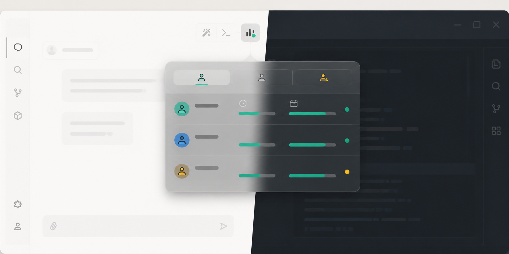
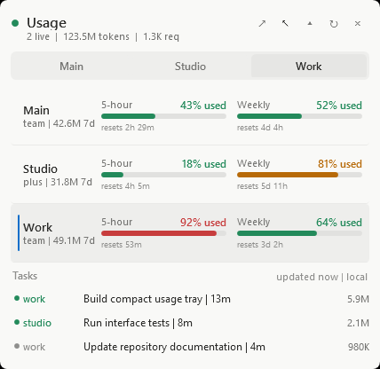
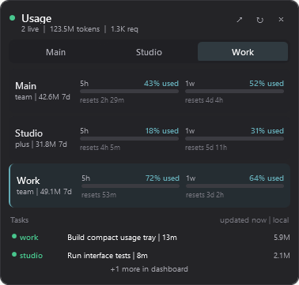

# OpenCodex Usage Tray

A small, native Windows companion for OpenCodex that keeps account usage and Codex task status within reach without turning into another dashboard window.



> [!IMPORTANT]
> This is an unofficial community tool. It is not made, endorsed, or supported by OpenAI or the OpenCodex project.

## Highlights

- Shows all three configured OpenCodex accounts at once.
- Keeps a 316-pixel compact strip visible by default with only the active account's 5-hour and weekly usage.
- Expands on demand to the full account switcher and task view, then collapses back to the strip.
- Displays 5-hour and weekly quota usage, seven-day tokens, and seven-day requests.
- Surfaces running, stalled, and recent Codex tasks with their account and token count.
- Switches the active OpenCodex account with one click.
- Uses Codex's native light and dark surfaces, typography, dividers, and control states.
- Stays above Codex while Codex is focused, hides when you use another app, and returns without taking keyboard focus.
- Lets you choose the top-left or bottom-left Codex content corner and remembers the choice.
- Reserves the right side for Codex Browser in either corner mode.
- Opens the full OpenCodex dashboard from a compact header button.
- Runs as a notification-area app across every Codex task; it is not attached to one chat.

The tray reads local OpenCodex management endpoints and Codex's local task databases. It does not host a web page or run its own server.

## Screenshots

### Permanent compact view


### Expanded details

| Light theme | Dark theme |
| --- | --- |
|  |  |

Screenshots use demonstration account names and usage values; the installed tray reads your local OpenCodex data.

## Requirements

- Windows 10 or Windows 11.
- The OpenAI Codex desktop app.
- A working local OpenCodex installation with up to three authenticated Codex accounts.
- Node.js 22 or newer with the built-in `node:sqlite` module.
- Windows PowerShell 5.1 or PowerShell 7.

OpenCodex should be running before the tray starts. The tray reads the dashboard port from OpenCodex's local configuration and falls back to `http://127.0.0.1:10100/`.

## Install

1. On this GitHub page, select **Code > Download ZIP**, then extract the ZIP. Alternatively, clone the repository with Git.
2. Start OpenCodex and confirm its local dashboard loads.
3. Open PowerShell in the extracted `opencodex-usage-tray` folder.
4. Run:

   ```powershell
   powershell.exe -NoLogo -NoProfile -STA -ExecutionPolicy Bypass -File .\install.ps1
   ```

Administrator access is not required. The installer:

- validates Node.js and `node:sqlite`;
- records the absolute Node.js path for reboot-safe startup;
- installs the app in `%LOCALAPPDATA%\OpenCodexUsageTray`;
- creates an **OpenCodex Usage** Start menu shortcut;
- creates a per-user Windows sign-in launcher that runs without a visible terminal and restarts the tray after a failure; and
- launches the tray and checks that it reached a ready state.

Use `-NoStart` to install without launching it immediately:

```powershell
powershell.exe -NoLogo -NoProfile -STA -ExecutionPolicy Bypass -File .\install.ps1 -NoStart
```

`-NoStart` does not disable automatic startup at the next Windows sign-in.

## Use

The popup is intentionally tied to the Codex window rather than to a particular Codex task. Once enabled, it follows you across all chats.

The default permanent view is a 316×62 compact strip. It shows only the active account, its plan, the two quota windows, a dashboard shortcut, and an expand button. The expanded view contains all accounts, account switching, resets, tasks, refresh, positioning, and collapse controls.

| Control | Action |
| --- | --- |
| Account button | Makes that account active in OpenCodex |
| `▾` | Expands the compact strip to the full account and task view |
| `▴` | Collapses the full view back to the active-account strip |
| `↗` | Opens the full OpenCodex dashboard |
| `↖` or `↙` corner button | Moves the popup between the top-left and bottom-left Codex content corners |
| `↻` | Refreshes quotas and task status immediately |
| `×` or `Esc` | Hides the popup while leaving the tray running |
| Tray icon, left-click | Shows or hides the popup |
| Tray icon, right-click | Opens show, refresh, dashboard, popup-corner, and exit commands |
| **OpenCodex Usage** in Start | Starts the tray or reveals the existing instance for at least 20 seconds |

Account switching is not display-only: it changes the active account used by OpenCodex. The popup confirms the switch and then refreshes usage.

The tray checks local OpenCodex state every three seconds and resolves the active account from the live account ID. It does not assume that the primary account is named `__main__`, so usage follows whichever account is currently selected. Forced upstream quota refreshes remain limited to once every five minutes; use `↻` when an immediate upstream refresh is needed.

The **5-hour** and **Weekly** values both show percentage **used**, not percentage remaining. Green is below 75% used, amber is 75–89%, and red is 90% or higher.

### Focus and positioning

When the popup has been enabled:

- focusing Codex shows it above the Codex window;
- focusing another application hides it after any manual/startup reveal grace period;
- returning to Codex restores it without taking focus from the editor or chat;
- pressing the corner button, or choosing **Popup corner** from the tray menu, switches between top left and bottom left;
- opening Codex Browser keeps a reserved area on the right so the popup does not cover the Browser panel; and
- moving or resizing Codex causes the popup to reposition within the active monitor's working area.

If you explicitly hide the popup with `×`, `Esc`, or the tray icon, it stays hidden until you show it again.

## Start with Windows

The installer registers **OpenCodexUsageTray** in the current user's Windows `Run` registry key, the same startup channel used by OpenCodex on Windows. An invisible Windows Script Host supervisor starts the tray at every sign-in, runs independently of Codex, and relaunches it 30 seconds after a failure. This avoids Windows silently skipping Startup-folder shortcuts. The installed tray records the Node.js runtime path that passed validation. The compact strip starts enabled, shows briefly after sign-in even if Codex has not regained focus yet, appears whenever Codex is focused, and hides while another app is focused. Exiting from the tray menu returns success so the supervisor stops it for the current session, but it starts again after the next Windows sign-in.

To disable automatic startup without uninstalling:

1. Open **Registry Editor**.
2. Go to `HKEY_CURRENT_USER\Software\Microsoft\Windows\CurrentVersion\Run`.
3. Remove **OpenCodexUsageTray**.

Run `install.ps1` again to recreate the startup value.

## Update

Download or pull the newer source and rerun `install.ps1`. The installer asks the running instance to stop, validates the existing install directory, replaces only known application files, recreates the shortcuts, and starts the updated version.

## Uninstall

From an extracted or cloned copy of the repository, run:

```powershell
powershell.exe -NoLogo -NoProfile -STA -ExecutionPolicy Bypass -File .\uninstall.ps1
```

The uninstaller disables automatic recovery, stops the tray, and removes its sign-in registry value, installed files, any legacy Scheduled Task or Startup shortcut, and Start menu shortcut. It does not remove OpenCodex, Codex, accounts, task history, or usage data.

## Troubleshooting

### The installer says Node.js is missing or too old

Check both the version and SQLite support:

```powershell
node --version
node -e "require('node:sqlite'); console.log('node:sqlite available')"
```

Install or select Node.js 22 or newer, then rerun the installer.

### The tray says OpenCodex data is unavailable

- Confirm OpenCodex is running and its local dashboard loads.
- Confirm `%USERPROFILE%\.opencodex\config.json` and `%USERPROFILE%\.opencodex\admin-api-token` exist.
- If you use non-default locations, set `OPENCODEX_HOME` and `CODEX_HOME` before starting the tray.
- Refresh from the tray menu after OpenCodex becomes available.

### The tray does not appear after Windows sign-in

- Start **OpenCodex Usage** from the Start menu; it reveals an existing tray instance if one is already running.
- In Registry Editor, confirm **OpenCodexUsageTray** exists under `HKEY_CURRENT_USER\Software\Microsoft\Windows\CurrentVersion\Run`.
- Check `%LOCALAPPDATA%\OpenCodexUsageTray\tray-startup-error.log` for a startup failure.
- Re-run `install.ps1` after changing Node.js installations so the recorded runtime path is refreshed.

### Codex is missing OpenCodex models after restart

If Codex starts before OpenCodex refreshes its injected catalog, run:

```powershell
ocx sync
ocx sync-cache
```

If `ocx` warns that a Codex app-server is still running, the disk catalog was updated but the selector can keep the old list until Codex is restarted.

The provider reads the port from OpenCodex's local configuration and falls back to port `10100`.

### The popup is not visible

- Focus the Codex desktop app; the popup hides while another app is active.
- Check the notification-area overflow menu and left-click the OpenCodex Usage icon.
- Open **OpenCodex Usage** from the Start menu to reveal an existing instance.
- If you selected **Exit usage tray**, start it again from the Start menu.

### An account will not switch

Open the full OpenCodex dashboard and check whether the account is paused, unhealthy, or needs authentication. Re-authenticate it there, then refresh the tray.

### The full dashboard button does not open a working page

Confirm the OpenCodex dashboard is reachable on the port stored in `%USERPROFILE%\.opencodex\config.json`. If the file has no valid port, the tray opens `http://127.0.0.1:10100/`.

## Privacy and security

- The tray has no telemetry and makes no direct remote requests.
- OpenCodex API calls are sent only to its loopback address, `127.0.0.1`.
- The OpenCodex management token is read from the existing environment variable or token file, used in process memory, and never displayed by the UI.
- Codex task databases are opened read-only.
- Switching accounts is the only OpenCodex state change, and it occurs only after you press an account button.
- The app writes only its installation files, a small readiness heartbeat, the selected popup corner, and per-user shortcuts.

Treat the OpenCodex admin token as a credential. Do not publish it, copy it into an issue, or expose the OpenCodex management API beyond the local machine.

## Project files

| File | Purpose |
| --- | --- |
| `OpenCodexUsageTray.ps1` | WPF popup, focus behavior, theme, and tray controls |
| `OpenCodexUsageTray.WinForms.ps1` | Preserved legacy presentation for rollback and troubleshooting |
| `status-provider.mjs` | Local OpenCodex and read-only Codex task data adapter |
| `Start-OpenCodexUsageTray.vbs` | Invisible Start menu launcher and crash-recovery supervisor |
| `test-provider.mjs` | Quota mapping and dynamic active-account regression tests |
| `install.ps1` | Safe per-user installation, sign-in registration, and shortcut creation |
| `uninstall.ps1` | Safe removal of startup registration, installed files, and shortcuts |
| `OpenCodexUsage.ico` | Application and notification-area icon |
| `test.ps1` | Offline syntax, provider projection, refresh-cadence, and documentation-asset validation |

There is no build step. To run directly from a checkout for development:

```powershell
powershell.exe -NoLogo -NoProfile -STA -ExecutionPolicy Bypass -File .\OpenCodexUsageTray.ps1 -ShowOnStart
```

Stop that instance with:

```powershell
powershell.exe -NoLogo -NoProfile -STA -ExecutionPolicy Bypass -File .\OpenCodexUsageTray.ps1 -Mode Stop
```

## Limitations

- Windows only.
- The compact layout is designed for a maximum of three OpenCodex accounts.
- Task status depends on the local Codex database schema and may require updates after major Codex releases.
- Very narrow Codex windows leave less room for the popup; it remains constrained to the monitor's working area.

## License

MIT. See [LICENSE](LICENSE).
